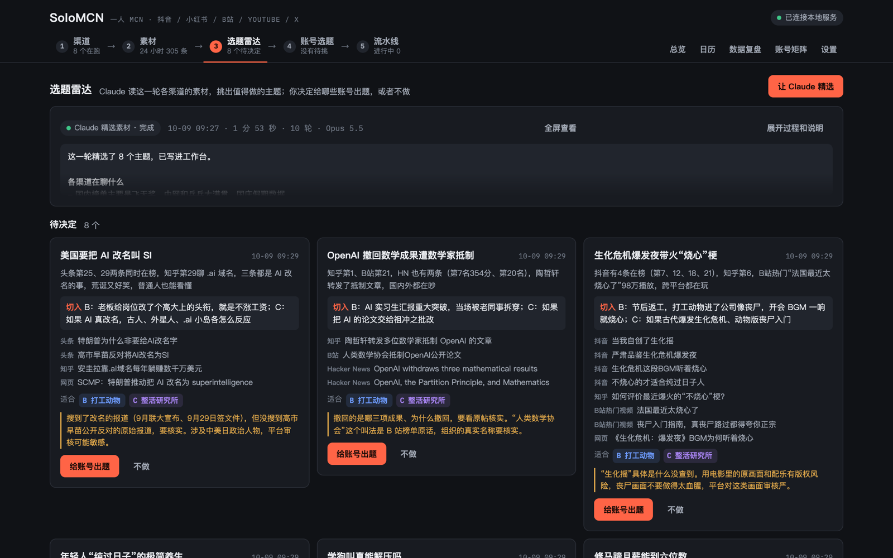
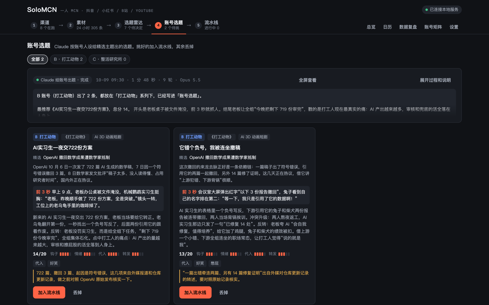
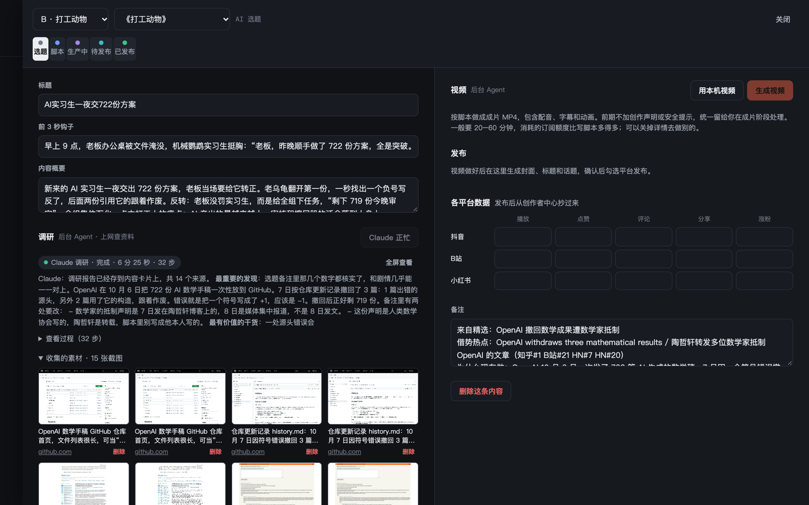
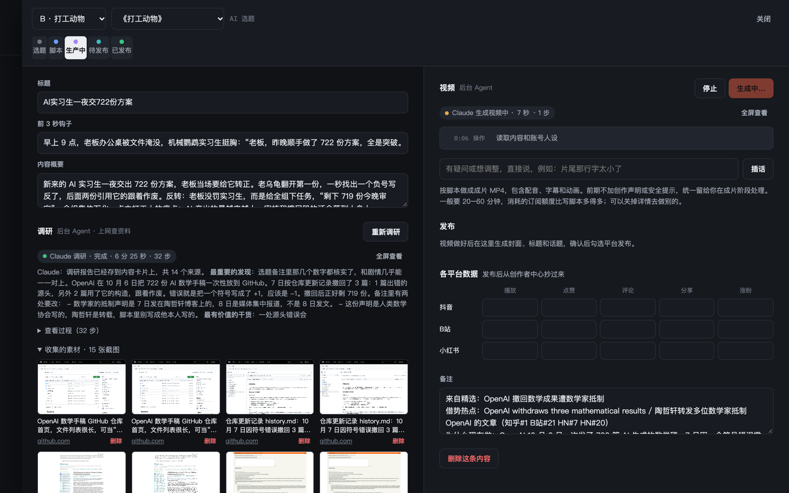
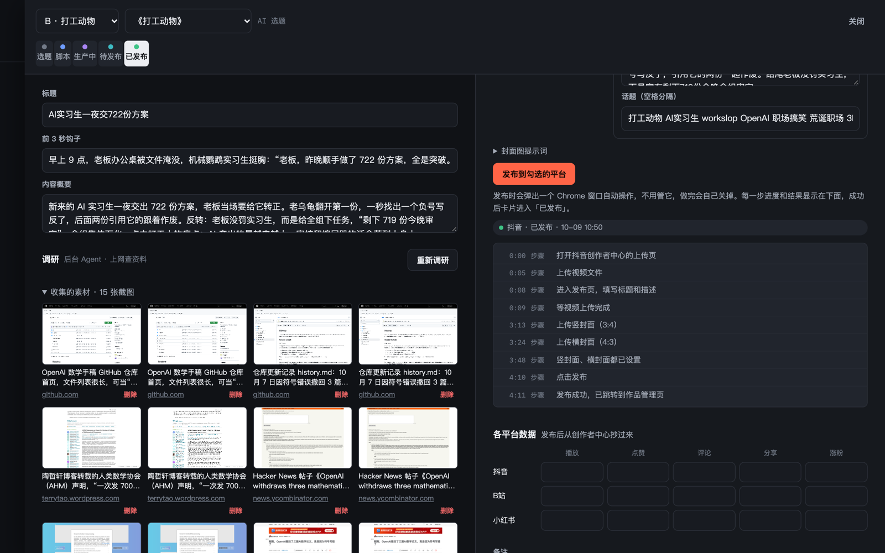

<div align="center">

# SoloMCN


https://github.com/user-attachments/assets/3db8f9d6-2435-43d9-a3a7-a553002618d9


### Turn Claude Code into your short-video team

**Don't build workflows. Let Claude do the work. From trending topics to Douyin, Xiaohongshu, Bilibili and YouTube, one person runs a whole channel network, and every step is done by Claude itself.**

[中文](README.md) · MIT License · Powered by [Claude Code](https://claude.com/claude-code)

</div>



## A different way to build AI software

Most AI apps start with a workflow: drag nodes, wire them up, hard-code a prompt at every step, plug in a pile of APIs. The AI can only ever do what the workflow allows.

SoloMCN goes the other way: **zero workflow building, drive Claude directly.**

|  | Workflow-built AI apps | SoloMCN |
|---|---|---|
| How a step is defined | Nodes, wires, fixed prompts | A plain-language "job description" (a Claude Code skill) |
| When something unexpected happens | Any branch nobody wired up gets stuck | Claude decides, switches approach, retries |
| How good it can get | Capped by the workflow design | **Claude's own ceiling.** Better models make the whole system better |
| What you configure | One API key per capability | One Claude subscription |
| Changing the process | Edit nodes and code | Edit a paragraph |

The workbench does just two things: **hands Claude its tools** (read and write channels and trends, capture web pages, publish to each platform) and **gives you a place to watch and decide**. The real work is done by Claude Code: it researches on the web, writes code to build the video, checks the frames and fixes its own mistakes.

### Things that actually happened

While making the demo video in this README:

- **Voice credits ran out.** The hosted voice-over allowance was zero. Nobody had written that branch. Claude set up a local voice on its own, gave the parrot, turtle and lion each a different voice, and finished the video.
- **One-sentence revisions.** We found the voice hard to understand and wrote one line in the workbench: "the voice is unclear, switch to the system Chinese voice". Claude re-voiced it, re-timed the captions and re-rendered, without touching a single frame, in 10 minutes.
- **It makes its own visuals.** The characters are original vector art it drew. The GitHub pages, news report and scholar's blog cut into the video are real pages it captured during research, with highlighter marks and red circles added.

None of this was a pre-built flow. Claude worked it out on the spot.

## From trend to publish, all handed to Claude

```
Trending lists ─→ Curate topics ─→ Ideas per channel ─→ Sourced research ─→ Storyboard ─→ Precheck
                                                                                   │
      Analytics ←─ Publish to Douyin / Xiaohongshu / Bilibili / YouTube ←─ Cover & copy ←─ Video
```

Every arrow is a Claude Code run. You watch each step live and can interject mid-run. You decide at three points: which idea to make, whether the video is good, whether to publish.

- **A one-person MCN.** Several channels, each with several series. Audience, tone, voice and visual style live on the series, so channels don't overlap.
- **Research with sources.** Before writing, Claude looks up real prices, capabilities, steps and counter-arguments, each with a source, and captures pages and official videos as footage.
- **It actually publishes.** One click to Douyin, Xiaohongshu, Bilibili and YouTube using a browser you logged into yourself, with portrait and landscape covers uploaded separately. Tick "manual" for any platform to get everything ready to copy and paste.
- **Bring your own video.** Pick a local file (not copied). Claude "watches" it (frames plus speech-to-text) and writes copy for each platform.
- **English or Chinese UI.** Switch in Settings; Claude's progress notes follow. Content language follows each series: describe a series as English and its ideas, scripts, voice-over and copy come out in English.

## Screenshots

| Ideas per channel | Research & footage |
|---|---|
|  |  |
| **Storyboard script** | **Publishing** |
|  |  |

## Quick start

All you need is a Mac and a Claude subscription. Open Terminal and run:

```bash
curl -fsSL https://raw.githubusercontent.com/ymybxx/SoloMCN/main/install.sh | bash
```

It installs whatever is missing (Homebrew, Node, Python, ffmpeg, Chrome, Claude Code), downloads SoloMCN to `~/SoloMCN`, installs dependencies, walks you through logging in to Claude Code if needed, then starts the app and opens it. Anything already installed is skipped, so it's safe to run again. To start later: `cd ~/SoloMCN && npm start`.

<details><summary>Prefer to install step by step?</summary>

You need:

| Need | Install |
|---|---|
| [Claude Code](https://claude.com/claude-code) | Install it and run `claude` once to log in |
| Node.js 22.9+ | `brew install node` |
| Python 3.11+ | `brew install python` (the macOS system 3.9 is too old) |
| ffmpeg | `brew install ffmpeg` |
| Google Chrome | Used for publishing |

```bash
git clone https://github.com/ymybxx/SoloMCN.git
cd SoloMCN
npm run setup     # Node dependencies, the Python env for the trends service, and the HyperFrames video skill
npm start
```

</details>

Open http://127.0.0.1:5178 and do the rest in the app:

1. **Channels** (账号矩阵): replace the 4 sample channels with your own and scan the QR code to bind each platform.
2. **Topic radar**: click "Let Claude curate" to start.
3. **Settings → Connections** (optional):
   - Paste a long-lived token from `claude setup-token` for more reliable background runs.
   - Add an OpenAI key (or any compatible endpoint and key) to have AI draw covers; otherwise a frame from the video is used.

Voice-over needs no key: hosted voices after logging in to HyperFrames, otherwise the macOS built-in Chinese voices.

## Changing the process = editing a paragraph

Each step is a job description (a Claude Code skill) that you view and edit on the Skills page:

| Skill | Responsible for |
|---|---|
| `curate-topics` | Picking topics worth making from the trending lists |
| `account-ideas` | Ideas that fit each channel and series |
| `research-topic` | Web research and footage capture |
| `write-script` | A storyboard script ready to produce |
| `precheck-content` | Pre-publish check |
| `make-video` / `revise-video` | Making the video, revising it from feedback |
| `review-data` | Analytics review |

Want sharper topics, shorter scripts or a different visual style? Edit the skill. No code involved.

Skills are your local data: the repo only ships defaults (`defaults/skills/`), copied to `.claude/skills/` on first start, and your edits are never committed. When a default improves, skills you haven't touched update automatically; edited ones show a notice and Claude can merge the improvements into your version. Running `/curate-topics` and friends directly in Claude Code uses the same files.

Pick the model and effort for each step in Settings (Opus, Sonnet, Haiku…). New model versions are used automatically: **when Claude gets better, SoloMCN gets better.**

## Layout

```
public/            UI (plain HTML/CSS/JS, no build step)
server/
  agent.js         Runs Claude Code (claude -p) skills in the background and streams each step
  mcp.js           Tools handed to Claude: channels and trends, picks, scripts, page capture…
  publish/         Browser publishing for Douyin, Xiaohongshu, Bilibili, YouTube
  assets.js        Captures web pages and videos as footage during research
  watch.js         "Watches" local videos: frame sheets plus speech-to-text
hot-service/       Trends service (Python): Douyin, Weibo, Bilibili, Zhihu, Baidu, Toutiao and Hacker News
defaults/skills/   Default job descriptions (yours live in .claude/skills/, never committed)
data/              Your data (channels, content, logins, keys), local only, never committed
videos/            Generated video projects, never committed
```

## Before you use it

- Publishing drives your own logged-in browser. Platform rules change; you are responsible for your accounts. Use "manual" for accounts you care about most.
- The skills keep one hard rule: never fabricate facts, numbers or quotes from real people. Everything else is your call.
- You are responsible for rights to footage, screenshots and music, and for each platform's content rules.

## Roadmap

- [ ] **AI staff**: each step becomes a configurable "employee" (scout, editor, writer, video editor, operator) with a job description, direction and budget, working together through tickets while you just set the direction.
- [ ] Scheduled runs: daily curation and ideas waiting for your approval.
- [ ] Automatic analytics collection from each platform.
- [ ] More platforms: Kuaishou, WeChat Channels, TikTok.

## Credits

Trending-list approach inspired by [TrendRadar](https://github.com/sansan0/TrendRadar), [newsnow](https://github.com/ourongxing/newsnow) and [DailyHotApi](https://github.com/imsyy/DailyHotApi). Videos are rendered with [HyperFrames](https://github.com/heygen-com/hyperframes) (Apache-2.0).

## License

[MIT](LICENSE)
