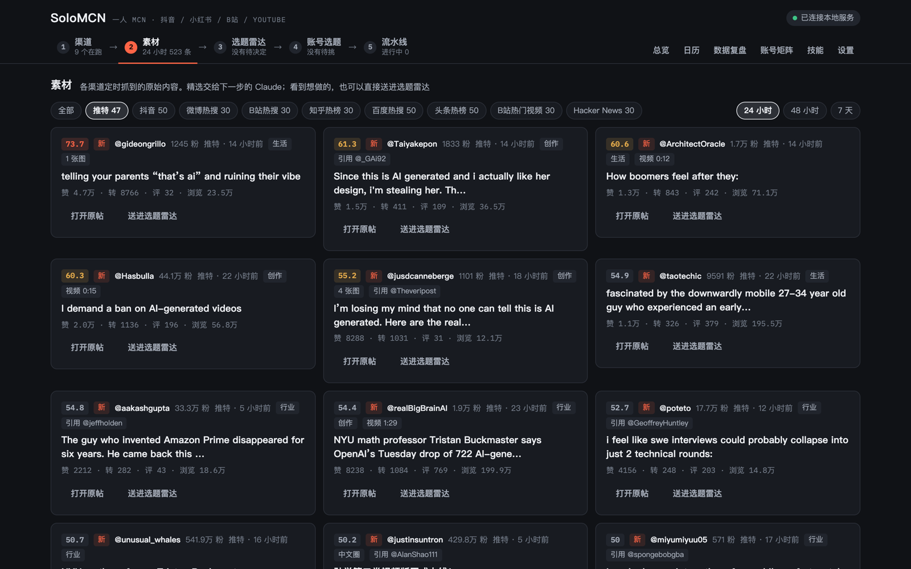
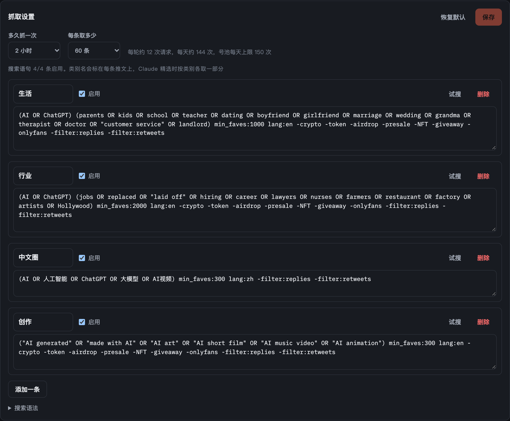

<div align="center">

# SoloMCN

https://github.com/user-attachments/assets/5b00fe30-f189-4c17-aa7a-f6080da1048b


### 把 Claude Code 变成你的短视频团队

**不搭工作流，直接让 Claude 干活。从国内热榜、推特热帖，到抖音、小红书、B站、YouTube、推特发布，一个人运营一个账号矩阵，每一步都是 Claude 亲手做的。**

[English](README.en.md) · MIT License · Powered by [Claude Code](https://claude.com/claude-code)

</div>


## 一种新的 AI 软件做法

过去做 AI 应用，要先搭工作流：拖节点、连线、写死每一步的提示词、接一堆 API。流程搭成什么样，AI 就只能做到什么样。

SoloMCN 反过来：**零搭建工作流，直接操纵 Claude。**

|  | 搭工作流的 AI 应用 | SoloMCN |
|---|---|---|
| 怎么定义一个环节 | 拖节点、连线、写死提示词 | 用中文写一份「岗位说明」（Claude Code 技能） |
| 遇到意外怎么办 | 流程没写到的分支就卡住 | Claude 自己判断、换方案、重试 |
| 能做到多好 | 被流程的设计卡死 | **能力就是 Claude 的上限**，模型升级，整个系统自动变强 |
| 要配什么 | 每个能力一个 API key | 一个 Claude 订阅 |
| 想改流程 | 改节点、改代码 | 改一段文字 |

工作台本身只做两件事：**给 Claude 递工具**（读写账号和素材、截网页、发布到各平台），**给你留看得见、拍得了板的地方**。真正干活的是 Claude Code：它自己上网查资料、自己写代码做视频、自己检查画面、出错了自己修。

### 真实发生过的

做这个 README 里的演示视频时：

- **配音额度用完了**：托管配音的免费额度是 0。没有人写过这个分支，Claude 自己装好本地语音，给鹦鹉、乌龟、狮子三个角色各配了一个声音，把片子做完。
- **一句话返工**：我们觉得配音听不清，在工作台里写了一句「配音听不懂，换成系统中文语音」。Claude 只重配了声音、重新对齐字幕、重新渲染，画面一帧没动，10 分钟交回新版。
- **自己做画面**：角色是它画的原创矢量图；中间穿插的 GitHub 页面、新闻报道、学者博客，是它调研时自己截下来的真网页，还加了荧光笔高亮和红圈。

这些都不是预先写好的流程，是 Claude 当场想出来的。

## 从热点到发布，全程交给 Claude

```
国内热榜 + 推特 ─→ 精选主题 ─→ 按账号出题 ─→ 调研（带出处）─→ 分镜脚本 ─→ 预审
                                                                           │
   数据复盘 ←─ 发到抖音 / 小红书 / B站 / YouTube / 推特 ←─ 封面和文案 ←─ 成片（配音、字幕、动画）
```

每个箭头都是一次 Claude Code 运行，页面上实时看它每一步在做什么，跑到一半还能插话。你只在三处拍板：做哪个选题、成片行不行、发不发。

- **一个人就是一个 MCN**：多个账号、每个账号多个系列，人群、风格、配音、视觉按系列配置，账号之间不撞车。
- **调研有出处**：写脚本前先上网查真实的价格、能力、步骤和反方观点，每条都有来源；能当画面的网页和官方视频顺手收集成素材。
- **看得到海外**：内置推特渠道，国内还没火的 AI 新玩法先一步拿到，详见下面「推特渠道」。
- **真能发出去**：一键发到抖音、小红书、B站、YouTube、推特，用你自己扫码登录的浏览器，竖横两种封面分别传好。不想自动发的平台勾「手动发」，复制粘贴就行。
- **现成视频也能发**：选一个本机视频（不复制），Claude 先「看」一遍（截画面、听语音），再写各平台的文案。
- **中英文界面**：在「设置」里切换，Claude 运行时的过程说明也跟着变。作品用什么语言按系列定，系列里写明做英文视频，选题、脚本、配音、文案就都是英文的。

## 推特渠道：先一步看到国内还没火的东西

很多 AI 新玩法、新工具先在推特上火，国内要晚几天甚至几周才有人做，这段时间就是做短视频的信息差。一般的热点工具只抓国内榜单，SoloMCN 能直接读推特：

- **不用申请开发者 API，不用付费**：在「渠道 → 推特」粘贴几个小号的 Cookie 就能用，账号资料只存在你本机。
- **按你的方向搜，不是只看热搜榜**：用推特的高级搜索语法写几类搜索语句，比如「AI + 家长、学校、恋爱」「AI + 失业、各行各业」「AI 生成的动画和短片」，设好点赞门槛，定时抓最近两天互动涨得最快的帖子。每条语句都能先「试搜」看看效果。
- **素材页直接看**：推文带全文、被引用的原帖、点赞转发浏览数、有没有视频，按每小时的互动速度排，24 小时、48 小时、7 天随时切换。看中的一键送进选题雷达。
- **Claude 自己会用**：精选时按类别读推文，和国内热榜放在一起判断哪些值得做；调研时能自己搜推特、看某个博主或某个列表的最新推文；看海外热点时带上推特趋势榜。
- **号池自己维护**：每个号定期用真实搜索体检，被推特限制搜索的号自动冷却、换号顶上，恢复了自动回来；每个号每天限量请求，两次请求之间留出间隔。
- **还能发推**：做好的视频一键发到你自己的推特账号，中文视频自动写中英双语推文，字数按推特的算法算好。

| 素材里的推特 | 自己定的搜索方向 |
|---|---|
|  |  |

> 号池是拿账号的登录 Cookie 去搜推特，不符合推特的服务条款，账号可能被限流或封禁。请用小号，不要用你自己的主号。

## 截图

| 账号选题 | 调研和素材 |
|---|---|
|  |  |
| **分镜脚本** | **发布** |
|  |  |

## 快速开始

只需要一台 Mac 和一个 Claude 订阅。打开终端，运行：

```bash
curl -fsSL https://raw.githubusercontent.com/ymybxx/SoloMCN/main/install.sh | bash
```

它会装好缺的软件（Homebrew、Node、Python、ffmpeg、Chrome、Claude Code），下载 SoloMCN 到 `~/SoloMCN`，装好依赖，没登录 Claude Code 的话带你登录一次，最后在后台启动并打开工作台。已经装好的都会跳过，可以放心重复运行。

装好后用 `solomcn` 命令启停，在任何目录、新开的终端里都能用：

| 命令 | 作用 |
|---|---|
| `solomcn start` | 在后台启动，关掉终端也不影响，就绪后打开浏览器 |
| `solomcn stop` | 停止 |
| `solomcn restart` | 重启 |
| `solomcn status` | 看看开着没有 |
| `solomcn open` | 在浏览器里打开工作台 |
| `solomcn logs` | 看运行日志 |
| `solomcn update` | 更新到最新版本，开着的话自动重启 |

开发调试时也可以在项目目录运行 `npm start`，在前台看输出，按 `Ctrl+C` 停止。

<details><summary>想自己一步步装</summary>

需要：

| 需要 | 安装 |
|---|---|
| [Claude Code](https://claude.com/claude-code) | 装好后在终端运行 `claude` 登录一次 |
| Node.js 22.9+ | `brew install node` |
| Python 3.11+ | `brew install python`（macOS 自带的 3.9 太旧） |
| ffmpeg | `brew install ffmpeg` |
| Google Chrome | 发布时用 |

```bash
git clone https://github.com/ymybxx/SoloMCN.git
cd SoloMCN
npm run setup     # 装 Node 依赖、热点服务的 Python 环境和做视频用的 HyperFrames 技能
npm start
```

</details>

打开 http://127.0.0.1:5178 ，剩下的都在页面里：

1. **账号矩阵**：改成你自己的账号和系列（首次启动带了 4 个示例账号），各平台点「扫码绑定」。
2. **选题雷达**：点「让 Claude 精选」，开始第一轮。
3. **设置 → 连接**（可选）：
   - 粘贴 `claude setup-token` 生成的长期令牌，后台运行更稳。
   - 填 OpenAI 的 key（或兼容接口的地址和 key），封面由 AI 画；不填就从成片里截一帧。

配音不需要 key：HyperFrames 登录后用托管配音，否则用 macOS 自带的中文语音。

## 改流程 = 改一段文字

每个环节是一份中文岗位说明（Claude Code 技能），在工作台的「技能」页里查看和修改：

| 技能 | 负责 |
|---|---|
| `curate-topics` | 从全网热榜里挑值得做的主题 |
| `account-ideas` | 按账号和系列的定位出选题 |
| `research-topic` | 上网调研、收集画面素材 |
| `write-script` | 写可以直接开工的分镜脚本 |
| `precheck-content` | 发布前预审 |
| `make-video` / `revise-video` | 做成片、按意见改片 |
| `review-data` | 看数据复盘 |

想让选题更毒舌、脚本更短、视频换一种画风，直接改对应的技能，不用碰代码。

技能是你的本地数据：仓库里只有出厂说明（`defaults/skills/`），第一次启动时复制到 `.claude/skills/`，之后你怎么改都不会进代码仓库。出厂说明更新时，没改过的技能自动跟着更新；改过的会提示你，可以让 Claude 把新版的改进合进你的版本。在 Claude Code 里直接输入 `/curate-topics` 之类手动跑，用的也是同一份。

每个环节用什么模型、想多深，在「设置」里选（Opus、Sonnet、Haiku 等系列和思考强度）。新模型发布后自动用上最新版：**Claude 变强，SoloMCN 就变强。**

## 结构

```
public/            页面（原生 HTML/CSS/JS，无构建步骤）
server/
  agent.js         在后台调起 Claude Code（claude -p）跑技能，实时转发每一步
  mcp.js           递给 Claude 的工具：读账号和素材、写精选、存脚本、截网页……
  publish/         各平台的浏览器发布（抖音、小红书、B站、YouTube、推特）
  assets.js        调研时截网页、存视频素材
  watch.js         「看」本机视频：抽帧拼图、语音转文字
hot-service/       热点数据服务（Python）：抖音、微博、B站、知乎、百度、头条热榜、Hacker News 和推特号池
defaults/skills/   每个环节的出厂岗位说明（在用的在 .claude/skills/，不进 git）
data/              你的数据（账号、内容、登录状态、密钥），只在本机，不进 git
videos/            生成的视频项目，不进 git
```

## 使用前请知道

- 各平台的自动发布是用你登录的浏览器模拟人工操作。平台规则和风控会变，使用者自行承担账号风险；重要账号建议用「手动发」。
- 推特号池是拿账号的登录 Cookie 去搜推特，不符合推特的服务条款，账号可能被限流或封禁。请用小号，不要用你自己的主号。
- 技能里只保留一条红线：不编造事实、数据和真人言论。其他创作上的取舍交给你。
- 素材、截图、音乐的版权和各平台的内容规范，请自行判断。

## 路线图

- [ ] **AI 员工团队**：把每个环节做成可配置的「员工」——素材员、选题编辑、编剧、剪辑、运营——各有岗位说明、工作方向和预算，员工之间用工单协作，你只管定方向。
- [ ] 定时自动跑：每天自动精选、出题，等你审批。
- [ ] 各平台数据自动回收，复盘闭环。
- [ ] 更多平台：快手、视频号、TikTok。

## 致谢

热榜的做法参考了 [TrendRadar](https://github.com/sansan0/TrendRadar)、[newsnow](https://github.com/ourongxing/newsnow) 和 [DailyHotApi](https://github.com/imsyy/DailyHotApi)；视频生成用的是 [HyperFrames](https://github.com/heygen-com/hyperframes)（Apache-2.0）。

## License

[MIT](LICENSE)
